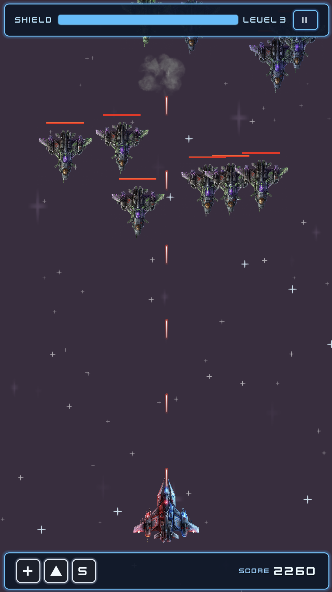
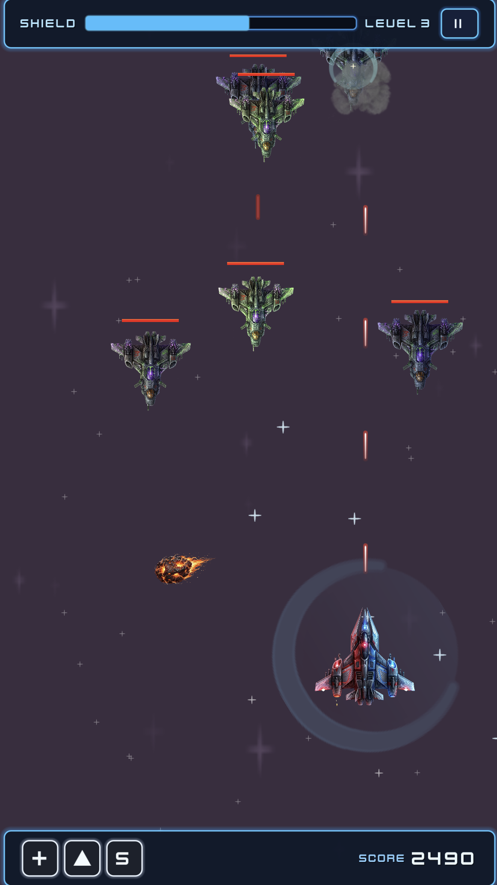
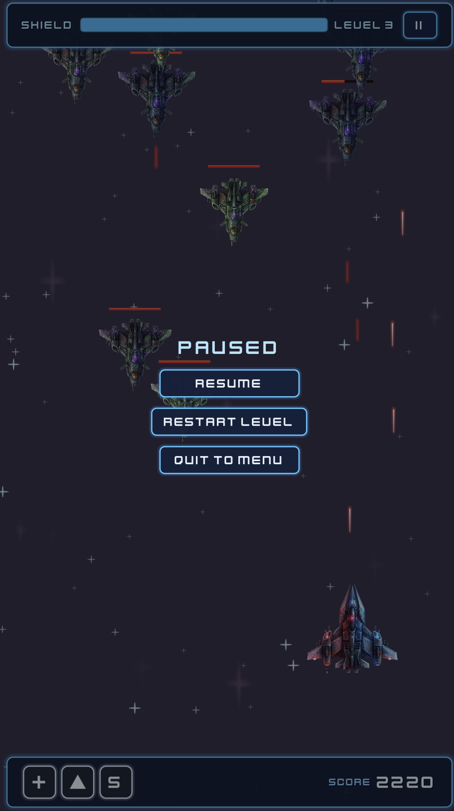
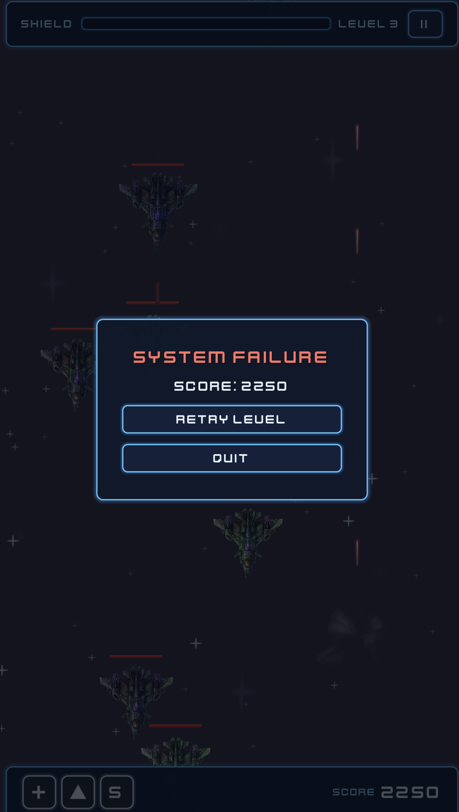

# Space Shooter with Godot

This game is developed using Claude Code (Opus) and Cursor (Composer).

Install Godot and run the game:

```bash
godot --path .
```

## Refinements

After each manual tests, I asked the agent (Cursor with Composer) to fix issues or update the design, e.g.:

```
- Reduce the size of the halo shield by %20.
- Enemies must not be hit and destroyed before they pass the top HUD. Once passed the HUD, enemies can get hit by the player's shots.
- Move the score text a bit up so that it aligns horizontally with the score value.
- Test and verify, and then update the plan file.
```

## Screenshots









## Exlosion effect

https://github.com/drcd1/GodotSimpleExplosionVFX
