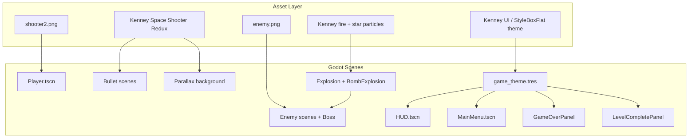

# UI and Graphics Upgrade Implementation Plan

> **Status:** Implemented (2026-06-21). Original visual upgrade complete; subsequent sessions added gameplay polish, custom enemy art, boss flow, pickups, and HUD iterations documented in **Changelog** below.

> **For agentic workers:** Use this doc as the source of truth for what shipped. Checkboxes reflect final state. Further work should extend the changelog, not re-do completed tasks.

**Goal:** Upgrade the space shooter from primitive `Polygon2D`/`ColorRect` placeholders to a cohesive modern sci-fi look: custom player sprite, Kenney CC0 assets for effects/background/UI chrome, custom `enemy.png` for all hostiles, and a diegetic cockpit-style HUD/menus themed to the ship's red/blue metallic palette.

**Architecture:** Visual assets live under `assets/` (sprites, fonts, UI theme). Gameplay scenes use `Sprite2D` nodes with collision shapes sized to match. Shared presentation helpers (`visual_effects.gd`, `scripts/enemy_health_bar.gd`, `scripts/explosion.gd`, `scripts/bomb_explosion.gd`) handle explosions, boss defeat cinematics, and hit-flash without touching pure logic tests (`difficulty.gd`, `game_manager.gd`, `save_data.gd`, `wave_pool.gd`). A single Godot `Theme` resource (`assets/ui/game_theme.tres`) styles HUD, main menu, game-over, and level-complete overlays. HUD renders on a `CanvasLayer` above gameplay.

**Tech Stack:** Godot 4.7 (GDScript), portrait 720×1280, GL Compatibility renderer, Kenney Space Shooter Redux (CC0), custom `shooter2.png` player sprite, custom `enemy.png` hostile sprite.

## Global Constraints (as shipped)

- Headless unit tests must pass (`godot --headless --script tests/...`).
- Kenney CC0 packs used for lasers, power-ups, explosions, backgrounds, and UI font.
- Player ship uses `assets/sprites/shooter2.png` (high-res; texture filtering enabled on import).
- Diegetic cockpit HUD: dark gunmetal panels, cyan accents, red low-HP warning, red boss HP bar.
- Skip post-process bloom, CRT shaders, and engine trails (mobile-safe on GL Compatibility).
- **Note:** Original plan said “no gameplay/balance changes”; post-plan sessions intentionally added boss flow, wave length, pickups, and balance tweaks documented in changelog.

## Visual Direction

**Style:** Modern sci-fi portrait shooter (Galaxy Attack feel) with diegetic cockpit HUD matching the ship's red/blue metallic aesthetic.

**Palette (derived from player sprite):**
- Background: deep space navy `#0a0e1a` with subtle nebula tint
- UI panels: dark gunmetal with cyan/blue accent lines and subtle glow shadows
- Alerts / low HP / boss HP: red accent
- Text: off-white primary, muted cyan secondary



## Approaches Considered

### A. Kenney-first (fastest)
Swap all placeholders for Kenney sprites + stock UI panels. Minimal custom styling.

- **Pros:** Fast, consistent art style, CC0 license
- **Cons:** Player sprite is higher-detail than Kenney enemies; UI may feel generic vs. diegetic goal

### B. Hybrid — Kenney gameplay + custom diegetic UI (recommended, **shipped**)
Use Kenney for bullets, pickups, explosions, and starfield textures. Custom `shooter2.png` + `enemy.png` for ship and hostiles. Build a custom Godot `Theme` + cockpit panels with red/blue accent styling.

- **Pros:** Best balance of speed and cohesion; diegetic HUD matches art direction
- **Cons:** Moderate UI build effort (StyleBoxes, font, layout)

### C. Shader-heavy polish
Same as B, plus glow/bloom post-process, engine trails, screen shake, hit flash shaders.

- **Pros:** Most "premium" feel
- **Cons:** GL Compatibility renderer limits shader options; higher scope/risk for mobile perf

**Shipped as:** **Approach B** + slice of C (multi-layer explosion particles, boss bombing cascade, subtle hit flash). No full post-process bloom.

---

## File Structure (as shipped)

```
space-shooter/
  assets/
    sprites/
      shooter2.png              # player (~1008×1054)
      enemy.png                 # all enemies + boss (custom, re-importable)
      rocket.png                # helper rocket summon asset
      logo.png
      laser2.png                # available; not used (player uses Kenney laserRed07)
      kenney/                   # Kenney Space Shooter Redux (extracted)
    ui/
      game_theme.tres
      progress_fill_normal.tres
      progress_fill_low.tres
      progress_fill_boss.tres
      ability_button_active.tres
      ability_button_active_hover.tres
      ability_button_active_pressed.tres
      ability_button_disabled.tres
    fonts/
      KenvectorFuture.ttf
    audio/                      # Kenney SFX + CC0 music (`starshooter.ogg`)
  scripts/
    visual_effects.gd           # spawn_explosion, spawn_hit_glow, spawn_rocket_impact
    hit_glow.gd
    explosion.gd
    bomb_explosion.gd
    enemy_health_bar.gd         # world-space red HP bars (Node2D _draw)
    health_bar_helper.gd
    wave_spawner.gd             # wave → boss phase, row spawning, deferred pickups
    hud.gd
    effects/
      Explosion.tscn            # 8×8 smoke spritesheet VFX (GodotSimpleExplosionVFX, MIT)
    pickup.gd
    player.gd                   # barrier, triple-shot, shield stacks
    boss.gd                     # attack cycle: 3/1/5/lightning, bob, fly-in
    enemy_bullet.gd             # enemy shots; player damage only
    helper_rocket.gd
    helper_rockets.gd
    lightning_bolt.gd
    enemy_zigzag.gd             # slower lateral + glow/tilt
    main.gd                     # boss defeat cinematic, HUD abilities
  scenes/
    HelperRocket.tscn
    LightningBolt.tscn
    effects/
      Explosion.tscn            # core + fire plume + embers
      BombExplosion.tscn        # staggered multi-blast boss defeat FX
      HitGlow.tscn              # 0.5s lightning ring on bullet hits
    HUD.tscn
  tests/
    test_enemy_spawn.gd         # integration: wave rows, boss phase, HUD
    test_difficulty.gd
    test_game_manager.gd
    test_save_data.gd
    test_wave_pool.gd
```

---

## Entity Visual Reference (current)

| Entity | Source | Scale / notes |
|--------|--------|---------------|
| Player | `assets/sprites/shooter2.png` | `Sprite2D` scale **0.15**; collision **112×144**; bullet offset **−60** Y; clamp margin **40** |
| Enemies (zigzag) | `assets/sprites/enemy.png` | green tint; **30% slower** lateral sine; glow pulse only (no bank tilt) |
| Helper rockets | `assets/sprites/rocket.png` | launch from **bottom** straight up at enemy speed; scale **0.128**; stagger **0.1–0.5s**; lightning impact |
| Boss | `assets/sprites/enemy.png` | scale **0.322**; red modulate; collision **284×284**; lightning via `LightningBolt.tscn` |
| Player bullet | Kenney `laserRed07.png` | scale **0.8×1.2** (reverted from custom `laser2.png`) |
| Enemy bullet | Kenney `laserRed03.png` | unchanged |
| Pickups | Kenney power-ups | scale **1.7** (2× original 0.85); collision radius **28** |

### Pickup kinds (`pickup.gd`)

| Kind | Visual | Effect |
|------|--------|--------|
| `weapon` | Kenney `powerupYellow_bolt.png` | Faster fire rate (**10s**) |
| `shield` | Kenney `powerupBlue_shield.png` | Timed invulnerability (**22s**); weighted drop |
| `barrier` | `assets/sprites/meteorite.png` (random scale/rotation) | One-hit absorb shield; destructible by player bullets (no score) |
| `triple` | Kenney `powerupBlue_star.png` | 3-shot spread (**16s**); weighted drop |

**Removed:** `speed`, `bomb` pickups.

---

## HUD Layout (current)

Single compact top row (vertically centered), boss bar strip below during boss fights, action buttons on bottom-left:

```
┌──────────────────────────────────────────────┐
│ SHIELD  [████████░░░░]  LEVEL 3  [II]        │  ← 18px labels, 20px HP bar, aligned center
├──────────────────────────────────────────────┤
│ BOSS    [██████░░░░░░░░░░░░░░]               │  ← visible only during boss (red fill)
│                                              │
│            (gameplay area)                   │
│                                              │
│ [+] [▲]                    SCORE 12,450   │  ← one-use health + rocket summon (left)
└──────────────────────────────────────────────┘
```

- Top panel: `PanelContainer` ~44px tall; `HBoxContainer` alignment **center**.
- Shield + Level labels: same font size (**18**) and color.
- Boss bar panel: **offset_top = 90** (below player row).
- Bottom panel: **HealthBoostButton** (`+`, white-glow active / muted disabled styles) and **RocketSummonButton** (white **`▲`** icon, same chrome); both once per level; **SCORE** label vertically centered beside numeric score on the **right**.
- Boss warning overlay: **"WARNING: BOSS INCOMING"** (center screen, **0.5s** before boss spawn).
- Pause overlay: dim + **"PAUSED"** when tree paused (excludes level-complete/game-over); **Resume**, **Restart Level**, and **Quit to Menu** buttons; **SPACE** toggles pause.
- Low-HP bar fill swaps blue → red below **25%** (`progress_fill_low.tres`).

---

## Level & Boss Flow (current)

Every level follows **wave → boss → level complete**:

1. **Wave phase:** `BASE_ENEMY_COUNT` (**100**) × **1.1^(level−1)** enemies spawn in **rows of up to 3**, **150px** horizontal spacing, **35px** vertical stagger between rows, **0.075s** delay between rows; spawner throttles when **≥ 10** wave enemies are alive at once. Enemy **HP** and **speed** also scale **×1.1^(level−1)**.
2. **Boss phase:** When wave cleared → **0.5s** warning (`BOSS_WARNING_DURATION`, was 2.5s) → boss enters from **Y = −280**, descends at **120 px/s**, patrols at **Y = 240** with vertical bob (±28px).
3. **Boss combat:** Attack cycle rotates **3-shot spread → single → 5-shot spread → lightning fan** (7 bolts); side-to-side + vertical bob; HP **3000 × 1.2^(level−1)**; scale **0.322** (+20% from 0.268); world + HUD red health bars.
4. **Cinematic:** `BombExplosion.tscn` (9 staggered blasts) → **2s** delay (`BOSS_DEFEAT_DELAY`) → level-complete panel with congratulations text.
5. **Progression:** Player taps **Next Level**; `_start_level()` resets HP, powerups, HUD abilities, clears pickups/projectiles, then starts wave.

---

### Task 1: Assets and theme foundation

**Files:**
- Create: `assets/sprites/kenney/` (Kenney Space Shooter Redux, CC0)
- Create: `assets/fonts/KenvectorFuture.ttf`
- Create: `assets/ui/game_theme.tres`
- Create: `assets/ui/progress_fill_normal.tres`, `progress_fill_low.tres`, `progress_fill_boss.tres`
- Modify: `project.godot` (default theme, clear color)

- [x] **Step 1:** Download Kenney Space Shooter Redux into `assets/sprites/kenney/`
- [x] **Step 2:** Copy Kenvector Future font from pack bonus to `assets/fonts/`
- [x] **Step 3:** Create `game_theme.tres` with StyleBoxFlat panels, button states, ProgressBar track/fill, sci-fi font, glow shadows
- [x] **Step 4:** Set default clear color to deep space navy in `project.godot`
- [x] **Step 5:** Run `godot --headless --import` for `.import` files (incl. `enemy.png`, `shooter2.png`)

---

### Task 2: Gameplay sprites

**Files:**
- Modify: `scenes/Player.tscn`, `scenes/EnemyStraight.tscn`, `scenes/EnemyZigzag.tscn`, `scenes/EnemyShooter.tscn`
- Modify: `scenes/Bullet.tscn`, `scenes/EnemyBullet.tscn`, `scenes/Boss.tscn`, `scenes/Pickup.tscn`
- Modify: `scripts/pickup.gd` (texture per kind)

- [x] **Step 1:** Replace `Polygon2D` with `Sprite2D` + collision shapes in all entity scenes
- [x] **Step 2:** Wire player sprite from `assets/sprites/shooter2.png` (scale tuned to 0.15)
- [x] **Step 3:** Wire all enemies/boss from custom `assets/sprites/enemy.png` (Kenney enemies superseded)
- [x] **Step 4:** Map six pickup kinds to textures in `pickup.gd`
- [x] **Step 5:** Player bullet uses Kenney `laserRed07` (custom `laser2.png` tried and reverted)

---

### Task 3: Background and parallax

**Files:**
- Modify: `scripts/parallax_setup.gd`

- [x] **Step 1:** Static nebula layer using Kenney `Backgrounds/darkPurple.png`
- [x] **Step 2:** Kenney `Effects/star1.png` sprites at three scroll speeds
- [x] **Step 3:** Background layer motion_scale zero; star layers scroll

---

### Task 4: Diegetic HUD

**Files:**
- Modify: `scenes/HUD.tscn`, `scripts/hud.gd`
- Modify: `scenes/Main.tscn` (HUD on `CanvasLayer`)

- [x] **Step 1:** Top panel — single row: shield label, HP bar, level, pause (compact, center-aligned)
- [x] **Step 2:** Bottom score strip
- [x] **Step 3:** Low-HP progress bar fill swap (blue → red below 25%)
- [x] **Step 4:** `PauseOverlay` with dim rect + "PAUSED" label
- [x] **Step 5:** Boss HP strip (`BossBarPanel`) with red fill during boss fights
- [x] **Step 6:** Boss warning label ("WARNING: BOSS INCOMING")
- [x] **Step 7:** Level label on `Main.tscn` level-complete panel; congratulations copy in `main.gd`

---

### Task 5: Menus and game-over overlays

**Files:**
- Modify: `scenes/MainMenu.tscn`, `scripts/main_menu.gd`
- Modify: `scenes/Main.tscn`, `scripts/main.gd`

- [x] **Step 1:** Style main menu with dark backdrop, cockpit panel, shared theme
- [x] **Step 2:** Style game-over with semi-transparent overlay, score panel, retry/quit
- [x] **Step 3:** Level-complete panel (`LevelCompleteLayer`) with next level / quit
- [x] **Step 4:** Apply shared `game_theme.tres` to all overlay roots

---

### Task 6: VFX polish

**Files:**
- Create: `scenes/effects/Explosion.tscn`, `scripts/explosion.gd`
- Create: `scenes/effects/BombExplosion.tscn`, `scripts/bomb_explosion.gd`
- Create: `scripts/visual_effects.gd`
- Modify: `scripts/enemy_base.gd`, `scripts/boss.gd`, `scripts/player.gd`

- [x] **Step 1:** `Explosion.tscn` — three one-shot `CPUParticles2D` layers (core, fire plume, embers)
- [x] **Step 2:** `VisualEffects.spawn_explosion()` on regular enemy death
- [x] **Step 3:** `VisualEffects.spawn_boss_bombing()` — staggered multi-blast on boss defeat
- [x] **Step 4:** `VisualEffects.flash_sprite()` on player hit and barrier break
- [x] **Step 5:** World-space enemy/boss HP bars via `enemy_health_bar.gd` (red, thin)

---

## Changelog (iterative updates after initial plan)

### Session 1 — Core visual upgrade
- Kenney asset import, `game_theme.tres`, parallax nebula/stars.
- Sprite2D swap for all entities; audio hooks (`game_audio.gd`, Kenney SFX, CC0 music).
- Diegetic HUD + styled menus/game-over; `Explosion.tscn` + hit flash.

### Session 2 — Custom art & polish
- Player scale **0.30 → 0.15** (50% smaller); collision and bullet offset halved.
- HUD panels enlarged then later compacted; shiny StyleBox glow shadows.
- Custom `enemy.png` for all enemy types + boss; `laser2.png` for bullets (later reverted).
- World-space red enemy HP bars (`enemy_health_bar.gd`); boss HP bars wider/thinner.
- Faster staggered enemy spawn (`ENEMY_SPAWN_DELAY = 0.15`).

### Session 3 — Boss & progression
- Boss HP **300** base, growth **1.18**; HUD boss health bar.
- Boss defeat: `BombExplosion.tscn` + **3s** delay → level complete (delay later **2s**).
- Congratulations text on level complete; save progress on boss kill.
- Fixed `boss_spawned` signal order (spawn before emit so HUD can read boss HP).
- Fixed pickup drop physics error (`call_deferred` in `wave_spawner.gd`).

### Session 4 — Pickups, flow & HUD fixes
- **Every level:** enemy wave then boss (not every 5th level only).
- Six pickup types: added **barrier** (one-hit shield) and **triple** (3-shot spread).
- Pickups **2× size** (`PICKUP_SCALE = 1.7`); green speed box uses **bolt icon**.
- HUD rework: single aligned row; shield/level same font size; boss bar below.
- Player triple-shot: 3 bullets at ±**0.35** rad when `triple` pickup active.

### Session 5 — Wave length & boss shots
- **30 enemies** minimum per level (`BASE_ENEMY_COUNT = 30`, +3/level).
- **3-enemy rows** with horizontal spacing and row delays.
- Boss fixed at **5-shot** spread (`BOSS_BULLET_COUNT_BASE = 5`, no per-level increase).
- Boss defeat delay **3s → 2s**.
- HUD vertical center alignment; shield/level both **18px**.

### Session 6 — Boss polish, zigzag VFX, HUD abilities
- Boss enter speed **55 → 120 px/s**; vertical bob ±28px during patrol.
- Boss HP **1500 → 3000** base; attack cycle: **3 / 1 / 5 / lightning** (`LightningBolt.tscn`).
- Zigzag enemies: horizontal freq **30% slower** (`ZIGZAG_HORIZONTAL_FREQ = 2.1`); glow pulse + bank tilt.
- Bottom HUD: **+** health restore (once per level) and **rocket summon** (10 homing `HelperRocket.tscn`, once per level).
- Score label grouped on bottom-right: `SCORE` adjacent to numeric value.
- Level start resets HUD ability buttons via `hud.reset_level_abilities()`.

### Session 7 — Wave size, rocket launch, HUD polish
- Wave size **30 → 50** enemies per level (`BASE_ENEMY_COUNT = 50`).
- Removed zigzag **bank tilt** (kept glow pulse only).
- Ability buttons: green-glow **active** vs flat **disabled** styles (`ability_button_*.tres`).
- Rocket summon: **Button** with white-tinted icon; rockets spawn from **bottom of screen**, move upward at **enemy speed**; sprite scale **0.08 → 0.16** (2×).
- `enemy_bullet.gd` split from player bullet so enemy shots only damage the player.

### Session 8 — Boss timing, hit glow, music, rockets
- Boss warning **2.5s → 0.5s** (appears 2 seconds sooner).
- Shield pickup duration **6s → 12s** (`SHIELD_PICKUP_DURATION`).
- Background music swapped to calmer CC0 **`calm_space.ogg`** (Observing The Star, OpenGameArt).
- **HitGlow.tscn**: 0.5s lightning ring on player/enemy/boss bullet hits (`HIT_GLOW_DURATION`).
- Boss scale **0.268 → 0.322** (+20%).
- Helper rockets: **20% smaller** (0.128), straight upward only, random stagger **0.1–0.5s**, lightning explosion on impact.
- HUD ability buttons: centered icon/`+` alignment via compact margins + `HORIZONTAL_ALIGNMENT_CENTER`.

### Session 9 — Wave density, HUD polish, spawn cap, music revert
- Pre-boss enemy count **doubled**: `BASE_ENEMY_COUNT` **50 → 100** (level 1 wave = 100 enemies).
- **Max 10 active enemies** at once: `MAX_ON_SCREEN_ENEMIES := 10`; `wave_spawner.gd` waits before each spawn while `_alive_count ≥ 10`; boss phase starts only after the full wave is spawned and all enemies are cleared.
- Background music reverted to **`starshooter.ogg`** (−10 dB).
- HUD ability buttons: **white** border/glow styles (`ability_button_*.tres`); rocket button uses white **`▲`** text icon (not `rocket.png`); `+` and rocket icons centered in button squares (zero content margins).
- Player hit glow auto-clears after **0.5s** (`hit_glow.gd` tween + `queue_free`; `player.gd` replaces stale glow on repeat hits).
- Score label vertically aligned with score value (`ScoreGroup` center alignment + `score_title` offset).

### Session 10 — Combat tuning, pickups, pause menu, HUD polish
- **Pause overlay:** **Restart Level** and **Quit to Menu** buttons under `PAUSED` text (wired in `main.gd`).
- **Enemy speed:** +20% base speeds (straight **120**, zigzag **108**, shooter **72**); per-enemy random variance (**0.85–1.15×**); overlapping enemies never share the same speed (`wave_spawner._assign_unique_speed`).
- **Enemy hit zone:** invulnerable to player bullets until `y ≥ HUD_COMBAT_START_Y` (**90**); bullets pass through above HUD.
- **Pickups:** removed **speed** and **bomb**; weighted pool favors **shield** and **triple** (5× each vs weapon/barrier 2×); durations — weapon **10s**, shield **22s** (+10s), triple **16s** (+10s).
- **Barrier pickup:** procedural black rock icon (`barrier_rock_visual.gd`), unique shape per spawn.
- **Helper rockets:** cumulative random stagger **0.1–1.0s** between launches; **+30%** travel speed; sprite rotated **180°** (`visual.rotation = PI`).
- **Shield halo:** scale **2.4 → 1.92** (−20%).
- **HUD:** `+` button glyph shifted right via asymmetric style margins; score title offset **−10px**.

### Session 11 — Combat zone, pause UX, VFX, rockets, pickups
- **HUD combat line** applies to **bosses** too: no damage or attacks until `y ≥ HUD_COMBAT_START_Y` (**90**); shooter enemies also withhold fire until past HUD.
- **Pause overlay:** **Resume** button added (below `PAUSED`); **SPACE** toggles pause/resume (excludes level-complete and game-over screens).
- **Barrier pickup:** meteorite-style procedural art — craters, highlights, shadow (`barrier_rock_visual.gd`); player bullets destroy barrier pickups with **no score** (`Pickup` mask includes player bullets).
- **Enemy explosion:** stronger fire burst — extra `FireRing` particle layer, higher counts/velocity in `Explosion.tscn`.
- **Shooter speed:** slowest enemy type **72 → 79.2** (+10%).
- **Helper rockets:** spawn delays **0.2–2.0s** between each rocket; non-overlapping spawn positions (`helper_rocket` group + separation check); vertical lane stagger per index.
- **Pickup drop rate:** **+30%** (`0.15 → 0.195`, `PICKUP_DROP_CHANCE` constant).

### Session 12 — Explosion VFX, game-over ship, meteorite barrier, rocket speeds
- **Enemy explosion:** replaced Kenney CPU particles with **8×8 animated smoke/fire spritesheet** from [GodotSimpleExplosionVFX](https://github.com/drcd1/GodotSimpleExplosionVFX) (MIT, `assets/effects/explosion/smokesprite.png`); `AnimatedSprite2D` in `Explosion.tscn` plays 64-frame burst at 28 FPS.
- **Game over:** player ship **hidden + collision disabled** and explosion spawned at ship position (`player.destroy_ship()` / `restore_ship()` on retry).
- **Barrier pickup:** uses **`assets/sprites/meteorite.png`** with random scale/rotation (removed procedural `barrier_rock_visual.gd`).
- **Helper rockets:** each rocket gets a **unique speed** (**0.85–1.2×** base rocket speed via `HELPER_ROCKET_SPEED_VARIANCE_*`).

### Session 13 — Barriers, enemy speed, penta-shot, confirm dialog, player visual
- **Barriers (meteorite hazards):** spin while falling; **random fall speed** (90–180) and rotation speed; **3 bullet hits** to destroy; **explosion VFX** on destroy (shot or player contact); player contact also applies contact damage. Barrier spawn weight **2 → 6**.
- **Enemy speed +20%:** `BASE_ENEMY_SPEED` **120 → 144**; straight **144**, zigzag **129.6**, shooter **95**.
- **Player visual:** plain **`shooter2.png`** — removed hit flash/glow on damage; `Visual.modulate = Color(1,1,1,1)`.
- **Penta-shot ability:** new HUD button **"5"** next to rocket summon; **5-bullet spread for 10s**, **once per level** (disabled after use).
- **Confirm dialog:** pause **Restart Level** / **Quit to Menu** and game-over **Retry** / **Quit** show **"Are you sure?"** with **Yes** / **No** before executing.

### Session 14 — Difficulty scaling, spawn pacing, penta/triple priority
- **Barrier rotation +100%:** spin speed range **±2.5 → ±5.0** rad/s.
- **Penta-shot priority:** triple pickup **deferred** while penta-shot is active; 5-shot remains until penta duration ends, then deferred triple applies.
- **Faster enemy spawning:** row spawn delay **0.15s → 0.075s** (−50%).
- **+10% per level difficulty:** unified `LEVEL_DIFFICULTY_GROWTH` (**1.1**) scales enemy **count**, **HP**, **speed**, and **boss HP** (replaces linear +3 enemies/level and 20% boss HP growth).

### Bug fixes (across sessions)
- **Premature boss phase:** `_begin_boss_phase()` now waits until `_wave_spawn_complete` so off-screen despawn mid-wave no longer triggers the boss early.
- `Main.tscn` node order broke wave spawn (`GameOverSFX` before layers) — fixed.
- Stale pause after level complete — `get_tree().paused = false` in `main.gd` `_ready()`.
- Desktop mouse drag — canvas transform in `player.gd`.
- Bullet `area_entered` for enemy kills; off-screen enemy despawn emits `died`.
- Wave spawner uses preloaded scene constants (not exported Dictionary).
- Integration test resets save file and disables player fire during spawn assertions.

---

## Testing and Success Criteria

- [x] Game runs at 720×1280 portrait
- [x] Player renders from `shooter2.png`; drag, fire offset, and clamp feel correct at scale 0.15
- [x] Enemies/boss render from `enemy.png`; types differentiated by scale/tint
- [x] HUD readable: shield HP, level, score, pause, boss HP when applicable
- [x] Menus, game-over, and level-complete match cockpit aesthetic
- [x] Headless tests pass:

  ```bash
  godot --headless --script tests/test_difficulty.gd
  godot --headless --script tests/test_game_manager.gd
  godot --headless --script tests/test_save_data.gd
  godot --headless --script tests/test_wave_pool.gd
  godot --headless --script tests/test_enemy_spawn.gd
  ```

  `test_enemy_spawn.gd` verifies: 100-enemy wave, ≤10 active enemies on screen/incoming, ≤3 enemies per row, boss after wave clear, boss HUD bar visible.

---

## Out of Scope (still YAGNI)

- Polarity/red-blue gameplay mechanic tied to ship art
- Animated sprite sheets / ship damage states
- Post-process bloom or CRT shaders
- Combo counter
- Using custom `laser2.png` for player bullets (available asset; Kenney red laser shipped)
- `visual_setup.gd` helper (never added; collision tuned per scene)

---

## Kenney Asset Sources (CC0)

- [Space Shooter Redux](https://kenney.nl/assets/space-shooter-redux) — lasers, power-ups, explosions, backgrounds
- [UI Pack](https://kenney.nl/assets/ui-pack) — optional panel frames (StyleBoxFlat used in practice)
- [Particle Pack](https://kenney.nl/assets/particle-pack) — optional; fire sprites from Redux pack used

## Third-Party Assets

- [GodotSimpleExplosionVFX](https://github.com/drcd1/GodotSimpleExplosionVFX) (MIT) — `assets/effects/explosion/smokesprite.png` for enemy death explosions

**Import settings:** Filter enabled for high-res `shooter2.png` and `enemy.png`; Kenney sprites imported via Godot defaults. Re-run `godot --headless --path . --import` after updating custom PNGs.
